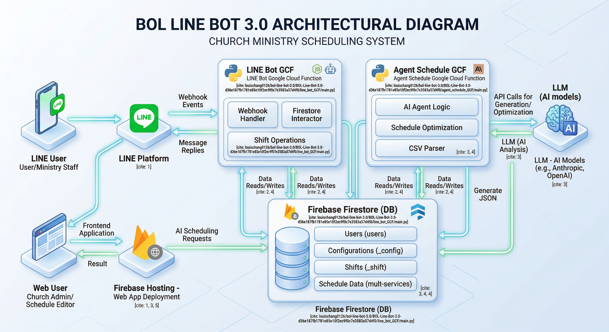
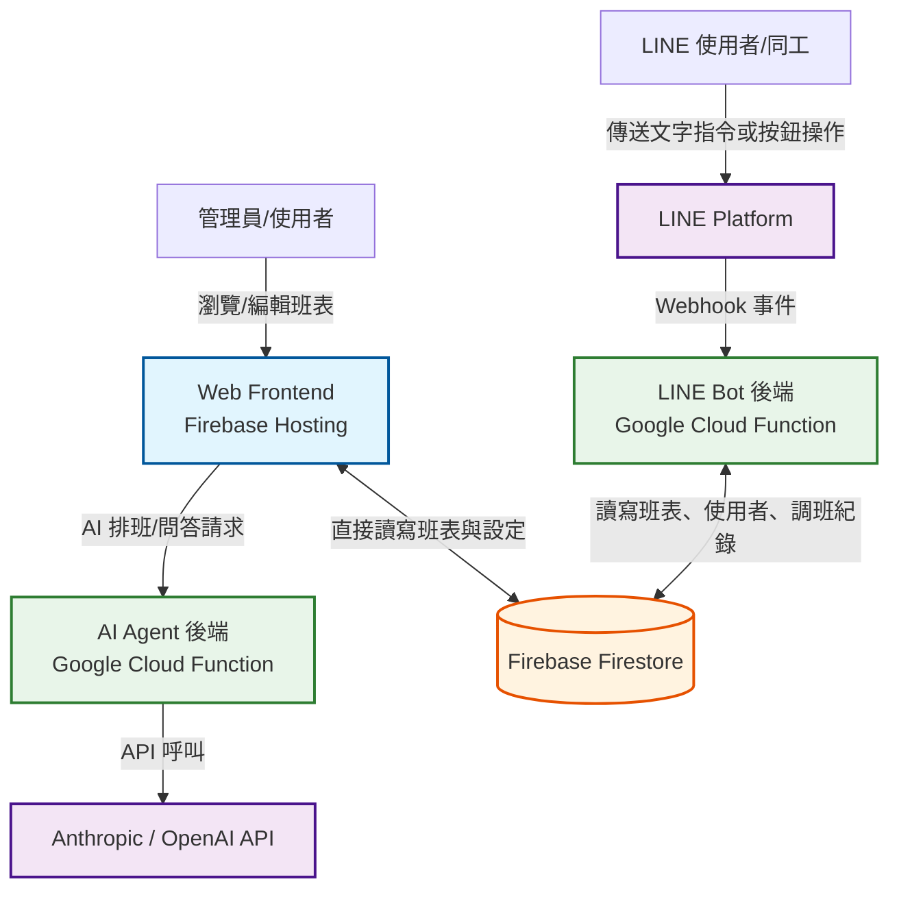

# BOL Line Bot 3.0 教會服事排班系統

## 專案簡介
這是一個專為教會服事設計的排班與管理系統。本系統提供多場崇拜的管理功能，並整合了 LINE Bot 讓同工可以輕鬆進行調班、代班與接收提醒，同時具備結合 LLM (大型語言模型) 的 AI Agent 來協助動態調整班表。

## 系統架構概念

## 系統架構

* **LINE Bot 後端 (`line_bot_GCF`)**：
  * 基於 Google Cloud Function 建立，負責接收並處理 LINE Platform 的 Webhook。
  * 提供使用者當週班表查詢、調班/代班申請與確認、以及服事提醒設定等功能。
* **網頁前端 (`schedule-app`)**：
  * 透過 Firebase Hosting 部署的 Web 應用程式。
  * 讓使用者與管理員能夠透過視覺化介面瀏覽與編輯班表，並串接 Firestore 與後端 Agent API。
* **AI 排班助理 (`agent_schedule_GCF`)**：
  * 基於 Google Cloud Function 建立的 HTTP API。
  * 串接 Anthropic 或相容於 OpenAI 的語言模型，可根據現有班表結構、CSV 人員資料與排班規則（如：避免連續服事、限制每週服事次數等），自動生成或修改排班 JSON 資料。
* **資料庫 (Firebase Firestore)**：
  * 作為系統唯一的資料來源，儲存包括使用者資料 (`users`)、全域設定 (`_config`)、調班狀態紀錄 (`_shift`) 以及各場崇拜的詳細班表。

## 目錄結構說明

* `line_bot_GCF/`：LINE Bot 邏輯處理模組，以 Python 撰寫。
* `agent_schedule_GCF/`：AI 排班輔助邏輯模組，以 Python 撰寫。
* `schedule-app/`：網頁前端專案目錄，包含 Firebase 設定與使用者介面。
* `firebase.json`：Firebase 部署配置檔，設定 `schedule-app` 為靜態網頁託管 (Hosting) 的公開目錄。